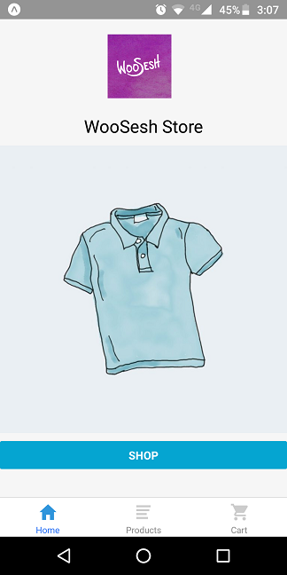
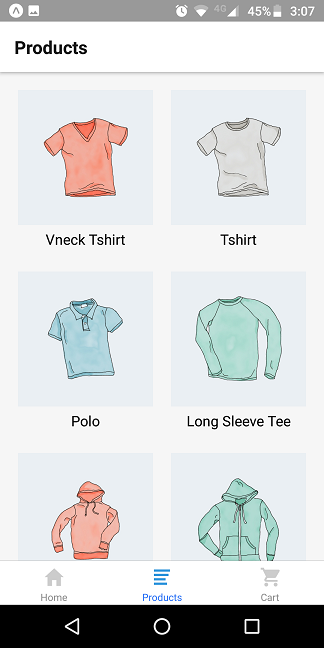
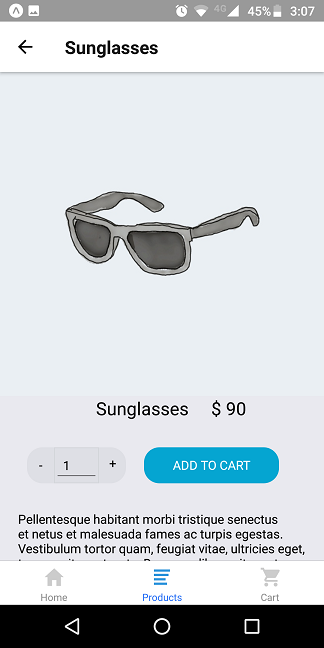
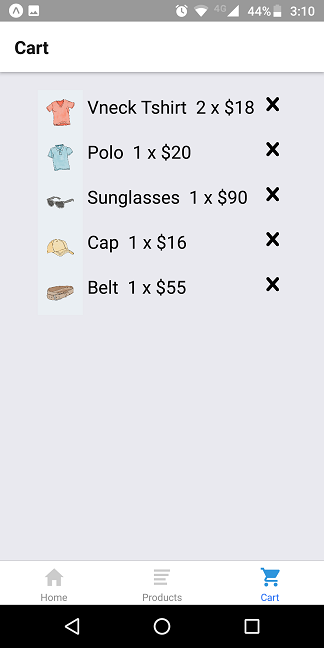

# React Native Woocommerce Store
A React Native mobile app using and WooCommerce at the back end. Works on iOS and Android.






This project was bootstrapped with [Expo CLI](https://www.npmjs.com/package/expo-cli).

## How to run

```
git clone https://github.com/m-muhsin/woosesh-store.git
cd woosesh-store
npm install
expo start
```

Open up Expo app in your iOS or Android phone. Scan the QR code appearing on the console or web page.

You can continue to edit and changes will be loaded onto your phone in real-time.

Happy coding!